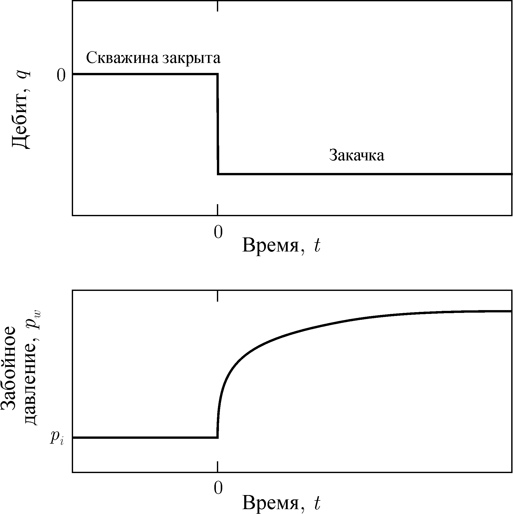

Идеализированная схема изменения дебита и давления во время исследования нагнетательной скважины при закачке:

Во время исследования при закачке с постоянным дебитом забойное давление в нагнетательной скважине описывается следующим уравнением:
$$p_{u^{w f}}=m \log t+p_{1 h r}$$

