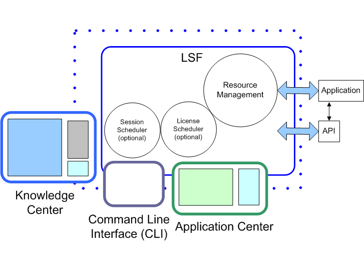

# Обзор LSF

---

*информация*

Источник: *ссылка на источник*

---

LSF distributes work across existing heterogeneous IT resources to create a shared, scalable, and fault-tolerant infrastructure, that delivers faster, more reliable workload performance and reduces cost. LSF balances load and allocates resources, and provides access to those resources.

Источник: https://www.ibm.com/docs/en/spectrum-lsf/10.1.0?topic=overview-lsf-introduction

---

An LSF cluster manages resources, accepts and schedules workload, and monitors all events. LSF can be accessed by users and administrators by a command-line interface

The core of LSF includes daemons and other functions to schedule and run jobs, and manage cluster resources.

Источник: https://www.ibm.com/docs/en/spectrum-lsf/10.1.0?topic=overview-cluster-components

---

Tools like this are typically used in HPC (High-Performance Computing) applications, in environments where you have large clusters of computers working together. The idea is that you submit a workload to the scheduler (typically a workload that is very compute-intensive and could benefit from different parts of it running in parallel), it figures out what computers are available to run the various pieces of the workload, and it farms out the individual pieces of the workload to the cluster members that it's selected. Then when everything is done running, it collects all the results and makes them available for you to collect.

This particular product is a specific case of a more general concept of job schedulers...

Источник: https://unix.stackexchange.com/a/620375

---

## Cluster

A group of computers (hosts) running LSF that work together as a single unit, combining computing power and sharing workload and resources. A cluster provides a single-system image for a network of computing resources.

Hosts can be grouped into clusters in a number of ways. A cluster could contain:

* All the hosts in a single administrative group

* All the hosts on one file server or sub-network

* Hosts that perform similar functions

## Job

A unit of work run in the LSF system. A job is a command submitted to LSF for execution. LSF schedules, controls, and tracks the job according to configured policies.

Jobs can be complex problems, simulation scenarios, extensive calculations, anything that needs compute power.

## Job slot

A job slot is a bucket into which a single unit of work is assigned in the LSF system. Hosts are configured to have a number of job slots available and queues dispatch jobs to fill job slots.

## Queue

A clusterwide container for jobs. All jobs wait in queues until they are scheduled and dispatched to hosts.

Queues do not correspond to individual hosts; each queue can use all server hosts in the cluster, or a configured subset of the server hosts.

When you submit a job to a queue, you do not need to specify an execution host. LSF dispatches the job to the best available execution host in the cluster to run that job.

Queues implement different job scheduling and control policies.

Источник: https://www.bsc.es/support/LSF/9.1.2/lsf_users_guide/index.htm?jobs_view_detailed.html~main

---

## LSF User Manual

IBM Spectrum LSF is a batch scheduler that allows users to run their jobs on high performance computing (HPC) clusters.

### Computing Resources

An HPC cluster is made up of a number of compute hosts, each with a complement of processors, memory, GPUs and burst buffers (burst buffer technology.)  Spectrum LSF refers to compute nodes as hosts.  The user submits jobs that specify the application(s) they want to run along with a description of the computing resources needed to run the application(s).

With the advent of Simultaneous Multithreading (SMT) architectures, single cores can have multiple hardware threads (sometimes known as hyper-threads).  The processing elements are generically called a core.

### The Batch Scheduler and Resource Manager

The batch scheduler and resource manager work together to run jobs on an HPC cluster.  The batch scheduler, sometimes called a workload manager, is responsible for finding and allocating the resources that fulfill the job’s request at the soonest available time.  When a job is scheduled to run, the scheduler instructs the resource manager to launch the application(s) across the job's allocated resources. This is also known as “running the job”.

The user can specify conditions for scheduling the job.  One condition is the completion (successful or unsuccessful) of an earlier submitted job.  Other conditions include the availability of a specific license or access to a specific file system.

### Batch Jobs

The bsub command is used to submit a batch script to LSF.  It is designed to reject the job at submission time if there are requests or constraints that LSF cannot fulfill as specified.  This gives the user the opportunity to examine the job request and resubmit it with the necessary corrections.

A batch job requests computing resources and specifies the application(s) to launch on those resources along with any input data/options and output directives.  The user submits the job, usually in the form of a batch job script, to the batch scheduler.

### Job Queues

A typical cluster is typically busy running jobs and will probably not be able to run a job when it is submitted.  So typically, the job is placed in a queue.  Specific compute host resources are defined for every job queue.

Each queue can be configured with a set of limits which specify the requirements for every job that can run in that queue.  These limits include job size, wall clock limits, and the users who are allowed to run in that queue.

Источник: https://hpc.llnl.gov/banks-jobs/running-jobs/lsf-user-manual

---

### What is LSF?

LSF manages, monitors, and analyzes the workload for a heterogeneous network of computers and it unites a group of UNIX and NT computers into a single system to make better use of the resources on a network. Hosts from various vendors can be integrated into a seamless system. You can submit your job and leave the system to find the best host to run your programs.

LSF supports sequential and parallel applications running as interactive and batch jobs. LSF also allows new distributed applications to be developed through LSF Application Programming Interface (API), C programming libraries and a tool kit of programs for writing shell scripts.

### LSF Features

With LSF you can use a network of heterogeneous computers as a single system. You are no longer limited to the resources on your own workstation. You do not need to rewrite or change your programs to take advantage of LSF. You only need to learn a few simple commands and the resources of your entire network will be within reach

LSF can automatically select hosts in a heterogeneous environment based on the current load conditions and the resource requirements of the applications.

With LSF, remotely run jobs behave just like jobs run on the local host. Even jobs with complicated terminal controls behave transparently to the user as if they were run locally.

LSF can run batch jobs automatically when required resources become available, or when systems are lightly loaded. LSF maintains full control over the jobs, including the ability to suspend and resume the jobs based on load conditions.

LSF can run both sequential and parallel jobs. Some jobs speed up substantially when run on a group of idle or lightly loaded hosts. For example, the LSF Make program allows you to do your software builds or automated tests many times faster than with traditional makes.

With LSF, you can transparently run software that is not available on your local host. For example, you could run a CAD tool that is only available on an HP host from your Sun workstation. The job would run on the HP and be displayed transparently on your Sun system.

With LSF, the system administrators can easily control access to resources such as:

* who can submit jobs and which hosts they can use
* how many jobs specific users or user groups can run simultaneously
* time windows during which each host can run load shared jobs
* load conditions under which specific hosts can accept jobs or have to suspend some jobs
* resource limits for jobs submitted to specific queuesLSF provides mechanisms for resource and job accounting. This information can help the administrator to find out which applications or users are consuming resources, at what times of the day (or week) the system is busy or idle, and whether certain resources are overloaded and need to be expanded or upgraded.

### Host Resources

LSF allows you to write your own load sharing applications, both as shell scripts using the lstools programs and as compiled programs using the LSF application programming libraries.

LSF provides comprehensive resource and load information about all hosts in the network.

Resource information includes the number of processors on each host, total physical memory available to user jobs, the type, model, and relative speed of each host, the special resources available on each host, and the time windows when a host is available for load sharing.

Dynamic load information includes:

* CPU load
* available real memory
* available swap space
* paging activity
* I/O activity
* number of interactive users logged in
* interactive idle time
* space in the /tmp directory
* arbitrary site-defined load indices

Источник: http://ls11-www.cs.tu-dortmund.de/people/hermes/manuals/LSF/users.pdf

---
