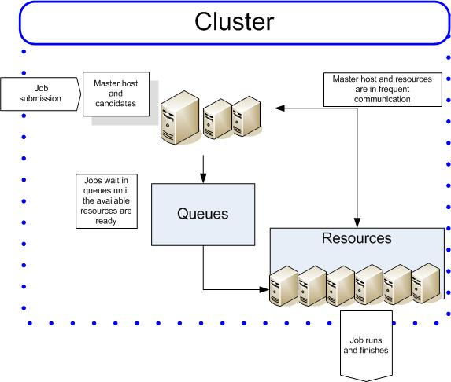

IBM Spectrum LSF -- это система очередей задач, позволяющая пользователям запускать задачи на кластере. Кластер состоит из множества вычислительных узлов, каждый из которых имеет набор процессоров и память. Пользователь отправляет задачу, в которой указана последовательность команд, которую он хочет запустить, вместе с описанием вычислительных ресурсов, необходимых для исполнения задачи: время, процессор, ядра, узлы.

Система очередей задач позволяет распределить пользовательские задачи сети для расчетов гидродинамических моделей с различными запрашиваемыми ресурсами: кол-во ядер, кол-во узлов.

Приложение клиент Scheduler позволяет пользователям рассчитывать на кластере гидродинамические модели. В нем поддерживаются системы очередей: Torque, PBS Pro, Slurm. В рамках курсовой работы была поставлена задача поддержки системы очередей IBM Spectrum LSF, поскольку кластеры различаются и у них могут быть установлены различные системы очередей.

